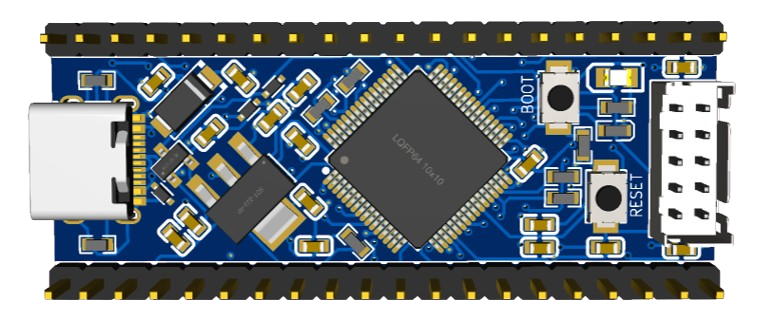
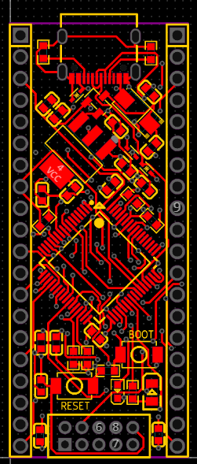
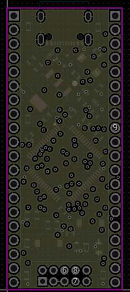
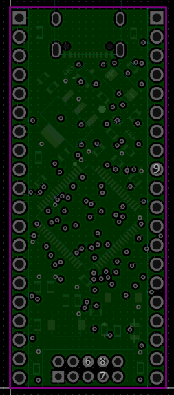
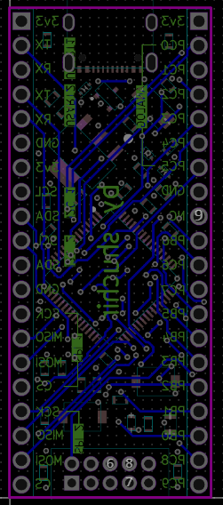

# STM32 Mini
A small, stm32f072 devboard in the pico form factor! I've played around with the RP2040 and various ESP32 chips for the past few years, but I wanted to try something different. The STM32 series of microcontrollers are very popular especially for low power usage, and I wanted to try using one myself. There's also less abstraction (imo-at least compared to MicroPython) when writing code for the STM32 and I think it'd be a great chance for me to advance my skills a little. 

## Stackup
The board follows a SIG-GND-PWR-SIG stackup.

SIG (1):

GND (2):

PWR (3):

SIG (4):

## Usage
1. Configure an IDE environment using STM32CubeMX and STM32CubeIDE. [This guide](https://wiki.st.com/stm32mcu/wiki/STM32StepByStep:Step2_Blink_LED) walks through the steps to configure the MCU. Use the STM32F072 when asked for an MCU part number
2. Enter the bootloader: plug the board into a laptop via USB. Hold BOOT and press RESET, then release both.
3. Build a release file via STM32CubeIDE. You'll find the release .elf file in the build output directory in your project folder
4. Follow [this guide](https://forum.digikey.com/t/stm32cubeprogrammer-quick-start-guide/28298) from Digikey to load and flash the release elf binary to the devboard.

### BOM
|Quantity|Comment                      |Value |Manufacturer Part                            |Manufacturer   |Supplier Part|Supplier  |Price |Link                                                |
|--------|-----------------------------|------|---------------------------------------------|---------------|-------------|----------|------|----------------------------------------------------|
|1       |1k?                          |1k?   |0603WAF1001T5E                               |UNI-ROYAL(??)  |C21190       |LCSC      |0.0002|                                                    |
|1       |1N4007                       |      |1N4007                                       |TWGMC(??)      |C727081      |LCSC      |0.0013|                                                    |
|1       |1uF                          |1uF   |CL10A105KB8NNNC                              |SAMSUNG(??)    |C15849       |LCSC      |0.0009|                                                    |
|1       |10k?                         |10k?  |0603WAF1002T5E                               |UNI-ROYAL(??)  |C25804       |LCSC      |0.0002|                                                    |
|1       |10nF                         |10nF  |0603B103K500NT                               |FH(??)         |C57112       |LCSC      |0.0005|                                                    |
|1       |75?                          |75?   |0603WAF750JT5E                               |UNI-ROYAL(??)  |C4275        |LCSC      |0.0002|                                                    |
|1       |AMS1117-3.3                  |      |AMS1117-3.3                                  |AMS            |C6186        |LCSC      |0.0286|                                                    |
|1       |AP2337SA-7                   |      |AP2337SA-7                                   |DIODES(??)     |C150497      |LCSC      |0.0215|                                                    |
|1       |KT-0603R                     |      |KT-0603R                                     |KENTO          |C2286        |LCSC      |0.001 |                                                    |
|1       |KT-0805G                     |      |KT-0805G                                     |KENTO          |C2297        |LCSC      |0.0023|                                                    |
|1       |PHD-2X5A                     |      |PHD-2X5A                                     |BOOMELE(????)  |C49123       |LCSC      |0.0066|                                                    |
|1       |STM32F072R8T6                |      |STM32F072R8T6                                |ST(?????)      |C87900       |LCSC      |0.2764|                                                    |
|1       |TYPE-C-31-M-12               |      |TYPE-C-31-M-12                               |????           |C165948      |LCSC      |0.0266|                                                    |
|2       |2.54-1*20P??                 |      |2.54-1*20P??                                 |BOOMELE(????)  |C50981       |LCSC      |0.0177|                                                    |
|2       |4.7uF                        |4.7uF |CL10A475KO8NNNC                              |SAMSUNG(??)    |C19666       |LCSC      |0.0015|                                                    |
|2       |5.1k?                        |5.1k? |0603WAF5101T5E                               |UNI-ROYAL(??)  |C23186       |LCSC      |0.0002|                                                    |
|2       |TS-1088-AR02016              |      |TS-1088-AR02016                              |XUNPU(??)      |C720477      |LCSC      |0.007 |                                                    |
|3       |10uF                         |10uF  |CL10A106KP8NNNC                              |SAMSUNG(??)    |C19702       |LCSC      |0.001 |                                                    |
|3       |LESD5D5.0CT1G                |      |LESD5D5.0CT1G                                |Leiditech(????)|C5246195     |LCSC      |0.0058|                                                    |
|4       |4.7k?                        |4.7k? |0603WAF4701T5E                               |UNI-ROYAL(??)  |C23162       |LCSC      |0.0002|                                                    |
|9       |100nF                        |100nF |CC0603KRX7R9BB104                            |YAGEO(??)      |C14663       |LCSC      |0.0004|                                                    |
|1       |20PCS 1x20 20PIN Single Row Straight Male Pin Header Connector 2.54MM|      |                                             |               |             |AliExpress|2.57  |https://www.aliexpress.us/item/2255800867206912.html|
|        |                             |      |                                             |               |             |          |      |                                                    |
|        |                             |      |                                             |               |             |Total     |3.014 |                                                    |