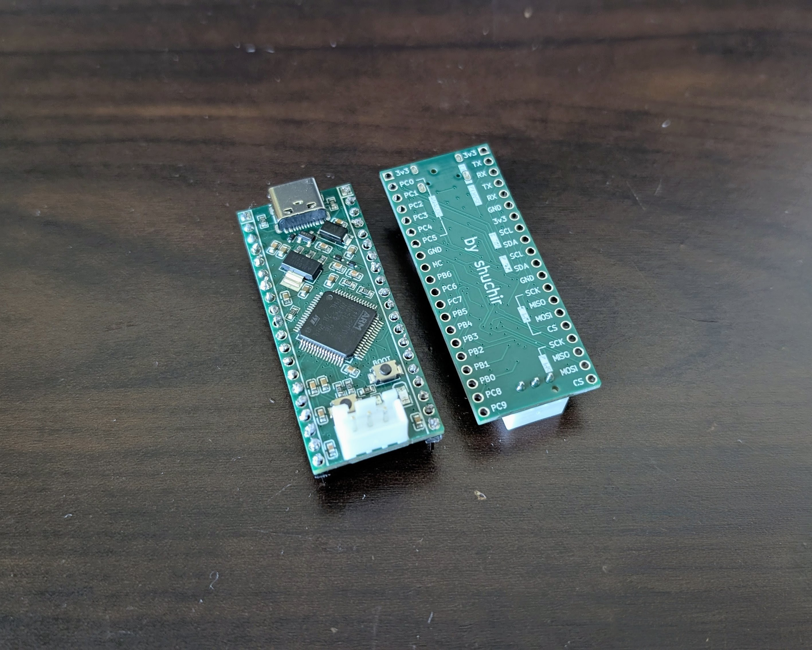
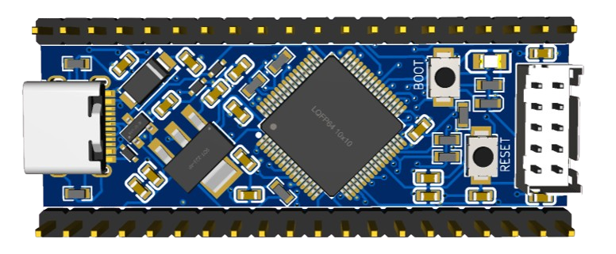
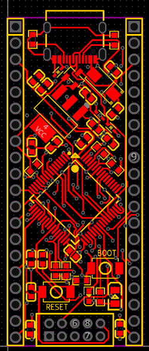
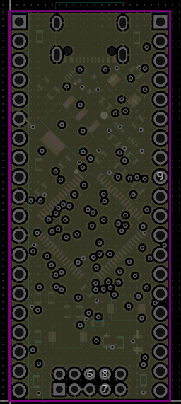
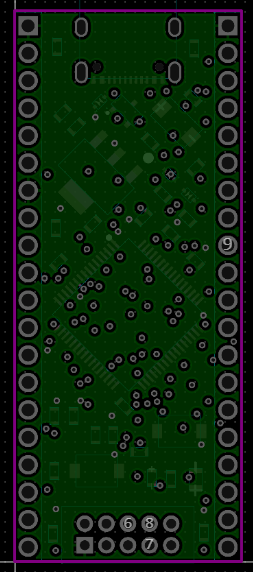
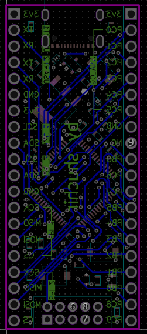

# STM32 Mini
A small, stm32f072 devboard in the pico form factor! I've played around with the RP2040 and various ESP32 chips for the past few years, but I wanted to try something different. The STM32 series of microcontrollers are very popular especially for low power usage, and I wanted to try using one myself. There's also less abstraction (imo-at least compared to MicroPython) when writing code for the STM32 and I think it'd be a great chance for me to practice my rust a little. 

## Usage
1. Clone and open the firmware/ folder (or clone the firmware repo directly: [ShuchirJ/stm32-blinky](https://github.com/ShuchirJ/stm32-blinky))
2. Install the Rust toolchain and the thumbv6m-none-eabi target (`rustup target add thumbv6m-none-eabi`) 
> [!NOTE]
> This step assumes you are connected via SWD debugger. If you want to flash the firmware using USB, install [rs-dfu](https://github.com/EdgeTX/rs-dfu) (or similar) and skip to step 4.
3. Build and flash the firmware using `cargo run --release`

Flashing via DFU: 
4. `cargo build --release`
5. `cargo objcopy --release --bin stm32-blinky -- -O binary target/thumbv6m-none-eabi/release/stm32-blinky.bin`
6. `rdfu write --start-address 0x08000000 target/thumbv6m-none-eabi/release/stm32-blinky.bin` (or similar command for an alternative dfu utility)

## Stackup
The board follows a SIG-GND-PWR-SIG stackup.

SIG (1):

GND (2):

PWR (3):

SIG (4):
